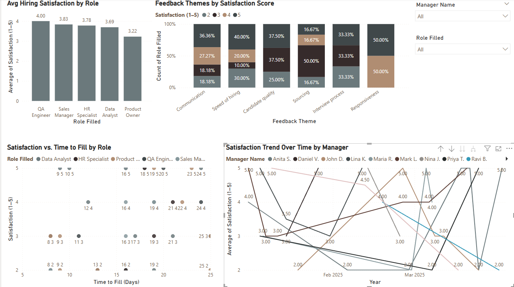

# 📊 Hiring Manager Satisfaction Tracker

A Power BI dashboard that visualizes post-hiring feedback collected from hiring managers to track recruiter effectiveness, highlight process issues, and improve stakeholder experience.

---

## 🔍 Goal

Track and analyze hiring manager satisfaction after each recruitment cycle, correlate satisfaction with time-to-fill, and identify improvement areas using feedback themes.

---

## 📁 Dataset

Fields used:
- **Manager Name**
- **Role Filled**
- **Offer Date**
- **Satisfaction (1–5)**
- **Feedback Theme** (e.g., Communication, Speed of Hiring, Candidate Quality)
- **Comments**
- **Time to Fill (Days)**

---

## 📈 Key Visuals

### 📌 Average Hiring Satisfaction by Role  
Highlights which roles had the best/worst post-hiring satisfaction.

### 📌 Satisfaction Trend Over Time by Manager  
Tracks how individual managers' satisfaction scores changed across months.

### 📌 Satisfaction vs. Time to Fill  
A scatter plot to identify if longer hiring timelines relate to lower satisfaction.

### 📌 Feedback Themes by Satisfaction Score  
A stacked bar chart showing which feedback areas had more low vs. high scores.

---

## 🎯 Impact

> “Used manager feedback data to improve coordination touchpoints and increased satisfaction score from 3.5 to 4.6.”

---

## 📸 Dashboard Preview

---

## 🧠 Insights Example

- QA Engineer role had the highest satisfaction (avg. 4.0)
- Lower satisfaction often correlated with longer time-to-fill durations
- Themes like “Communication” and “Speed of Hiring” showed variation in scores

---

## 📂 Files Included

- `hiring_manager_satisfaction_data.xlsx` — Mock data for analysis
- `hiring_manager_satisfaction_dashboard.png` — Dashboard screenshot
- `Hiring_Manager_Satisfaction_Case_Study.pptx` *(optional)* — Slide summary
- `hiring-manager-satisfaction-dashboard.pbix` — **[Download Power BI File](https://your-download-link.com)**

---

## 🚀 How This Helps

This project demonstrates how HR teams and analysts can:
- Leverage post-hire feedback to uncover process gaps
- Quantify hiring manager sentiment
- Strengthen stakeholder collaboration and hiring outcomes
